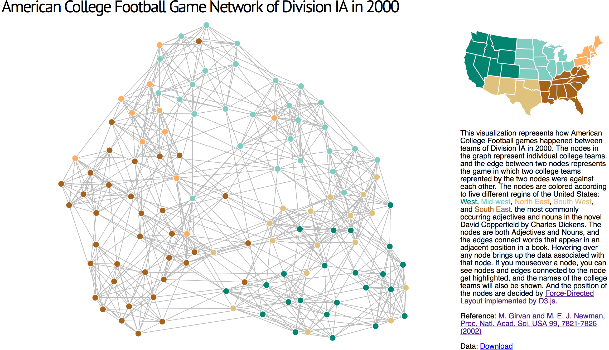

# American College Football Network of Division IA in 2000

This visualization represents how American College Football games happened between teams of Division IA in 2000.  The nodes in the graph represent individual college teams. and the edge between two nodes represents the game in which two college teams reprented by the two nodes were against each other.  The nodes are colored according to five different regins of the United States: West, Mid-west, North East, South West, and South East.  If you mouseover a node, you can see nodes and edges connected to the node get highlighted, and the names of the college teams will also be shown. And the position of the nodes are decided by <a href="https://github.com/mbostock/d3/wiki/Force-Layout">Force-Directed Layout implemented by D3.js.</a>

    
Reference: <a href="http://www.pnas.org/content/99/12/7821.full.pdf">M. Girvan and M. E. J. Newman, Proc. Natl. Acad. Sci. USA 99, 7821-7826 (2002)</a>

    
Data: <a href="http://www-personal.umich.edu/~mejn/netdata/football.zip">Download</a>

